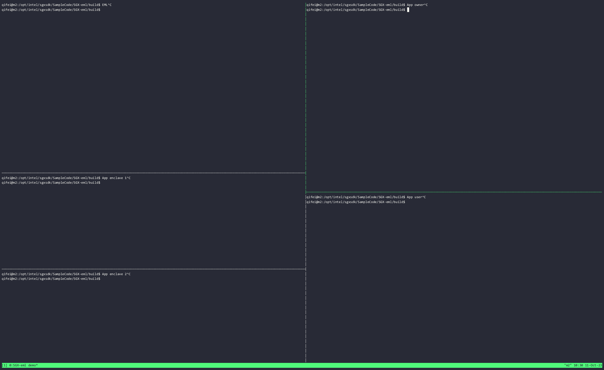

# SGX Enclave Management Layer (EML)



## Requirements
- Tested on Ubuntu 22.04.2 x86_64 with 5.15.0-76-generic kernel.
- Only tested under hardware mode.

## Build

This project uses CMake for building. Use the following commands to build the project:

``` console
$ mkdir build
$ cd build
$ cmake ..
$ make
```

## Configuration

Before running the EML, configure the file in the `build/config` folder as follows:

- Provide `SPID`, `IAS_PRIMARY_SUBSCRIPTION_KEY`, and `IAS_SECONDARY_SUBSCRIPTION_KEY` from the [Intel API portal](https://api.portal.trustedservices.intel.com/EPID-attestation) in `app_owner_config.toml`, `eml_config.toml`.
- Update `POLICY_MRSIGNER` and `POLICY_MRENCLAVE` value in `app_owner_config.toml` with the corresponding value from the MAKE output console.

## Execution

Run the following commands in order to start the EML:

```bash
$sudo ./eml <eml_config.toml> <app_port> <enclave_port>
$./app_owner <app_owner_config.toml> 127.0.0.1 <app_port>
$sudo ./app_enclave <app_enclave_config.toml> 127.0.0.1 <enclave_port>
```

## Overview

The EML, inspired by the paper "[ReplicaTEE: Enabling Seamless Replication of SGX Enclaves in the Cloud](https://arxiv.org/pdf/1809.05027.pdf)", is comprised of three main components:

1. **EML**: The EML serves as a bridge between the App Owner and the App Enclaves in a cloud-based remote setting, listening on two separate ports. The first port handles `Remote Attestation` (RA) with the App Owner and subsequently receives the App Owner's `secrets`. It also registers the enclave using provided enclave attributes (`MRSIGNER` and `MRENCLAVE`). The second port performs enclave-to-enclave RA, verifying if the enclave is registered and if the verification is successful, securely transfers the `associated secrets` to the App Enclave.

2. **App Owner**: The App Owner initiates the process by providing the EML with necessary enclave attributes (`MRSIGNER` and `MRENCLAVE`) and the `associated secrets` after a secure connection has been established through `Remote Attestation` (RA).

3. **App Enclave**:  The App Enclave communicates with the EML over a secure, enclave-to-enclave connection established through `Remote Attestation` (RA). Upon verification of the enclave's registration, the EML transfers the linked secrets from the App Owner to the App Enclave securely. The App Enclave can then begin providing its services.

The implementation of the EML System relies on the integrity of Intel's Software Guard Extensions (SGX) enclaves and their ability to perform RA, Sealing and UnSealing.

> Note: This implementation does not include the Byzantine Fault-Tolerant Storage Layer described in the original paper.


## References

- [Intel SGX Linux](https://github.com/intel/linux-sgx)
- [SGX Enclave-to-Enclave RA](https://github.com/LuminousXLB/SGX-enclave-to-enclave-ra) 